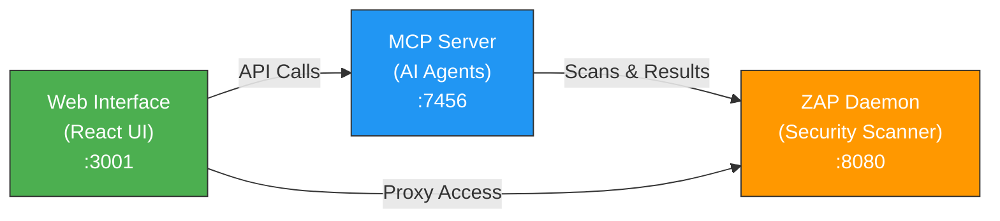

# ZAP Docker Compose Stack

Complete OWASP ZAP security testing stack with web UI and AI agent integration.

## Quick Start

```bash
# Clone repo
git clone https://github.com/gilby125/zaproxy-docker-compose.git
cd zaproxy-docker-compose

# Copy environment template
cp .env.example .env

# Generate MCP API key
openssl rand -hex 32  # Copy output to MCP_API_KEY in .env

# Deploy
docker compose up -d
```

## What's Included

| Component | Port | Purpose |
|-----------|------|---------|
| **ZAP Daemon** | 8082 (UI), 8090 (Proxy) | OWASP ZAP security scanner in daemon mode |
| **Web Interface** | 3001 | React UI for running scans, viewing reports, PDF export |
| **MCP Server** | 7456 | AI agent integration (Claude Code, etc.) |

## Architecture



## Environment Variables

### Required
- `MCP_API_KEY`: Security key for MCP server (generate with `openssl rand -hex 32`)

### Optional (have defaults)
```
# ZAP Domain (for Traefik/HTTPS)
ZAP_DOMAIN=zap.yourdomain.com

# IP Whitelist for web UI access
ADMIN_IP_WHITELIST=100.0.0.0/8,10.0.0.0/16

# ZAP API key (leave empty for api.disablekey=true)
ZAP_API_KEY=

# MCP Server settings
MCP_SECURITY_ENABLED=true
MCP_SECURITY_MODE=api-key

# Scan timeouts (seconds)
ZAP_MAX_ACTIVE_SCAN_DURATION=30
ZAP_MAX_SPIDER_SCAN_DURATION=10
ZAP_ALLOW_PRIVATE_NETWORKS=true

# Web interface public URL
PUBLIC_URL=http://192.168.1.191:3001
```

## Deployment

### Quick Start

```bash
# Clone and setup
git clone https://github.com/gilby125/zaproxy-docker-compose.git
cd zaproxy-docker-compose

# Configure environment
cp .env.example .env
# Edit .env with your values, especially MCP_API_KEY

# Deploy
docker compose up -d
```

Access:
- Web UI: http://localhost:3001
- ZAP API: http://localhost:8082
- Proxy: localhost:8090

### On a Remote Server

```bash
# SSH to your server
ssh user@your-server

# Clone repo
git clone https://github.com/gilby125/zaproxy-docker-compose.git
cd zaproxy-docker-compose

# Setup environment
cp .env.example .env
nano .env  # Edit with your values

# Deploy
docker compose up -d
```

Then access via your server IP:
- http://YOUR_SERVER_IP:3001 (Web UI)
- http://YOUR_SERVER_IP:8082 (ZAP API)
- YOUR_SERVER_IP:8090 (Proxy)


## Usage

### Web Interface (http://localhost:3001)
1. Enter target URL
2. Click "Start Scan"
3. Monitor real-time progress
4. Download PDF report when complete

### Claude Code Integration

Configure MCP server in Claude Code:
```bash
claude mcp add --transport http \
  --url http://YOUR_IP:7456/mcp \
  --header "X-API-Key=YOUR_MCP_API_KEY"
```

Then ask Claude Code to:
- "Spider scan https://example.com"
- "Show me security alerts"
- "Run an active scan"

### Direct API Access

Via web interface proxy:
```bash
curl http://localhost:3001/zap/JSON/core/view/version/
```

Via direct ZAP (if exposed):
```bash
curl http://localhost:8082/JSON/core/view/version/
```

## Security

- **Web UI**: IP-restricted via Traefik (`ADMIN_IP_WHITELIST`)
- **MCP Server**: API key protected (`MCP_API_KEY`)
- **ZAP API**: Optional API key (`ZAP_API_KEY`)
- **Proxy (8090)**: Use firewall rules or SSH tunnel for remote access

## Security Best Practices

1. **Always set `MCP_API_KEY`** - Required for AI agent access
2. **Keep `.env` local** - Never commit to repo
3. **Restrict proxy port (8090)** - Use firewall or SSH tunnel:
   ```bash
   ssh -L 8090:localhost:8090 user@your-server
   ```
4. **IP whitelist** - Update `ADMIN_IP_WHITELIST` with your IPs
5. **HTTPS** - Set `ZAP_DOMAIN` for automatic Let's Encrypt cert

## Advanced: Using ZAP as HTTPS Proxy

### 1. Download CA Certificate
```bash
# From web UI: Tools → Options → Dynamic SSL Certificates → Save

# Or via API:
curl http://localhost:8082/OTHER/core/other/rootcert/ > zap-ca.cer
```

### 2. Install Certificate

**Linux:**
```bash
sudo cp zap-ca.cer /usr/local/share/ca-certificates/
sudo update-ca-certificates
```

**macOS:**
```bash
sudo security add-trusted-cert -d -r trustRoot -k /Library/Keychains/System.keychain zap-ca.cer
```

**Windows:** Double-click → Install Certificate → Trusted Root

### 3. Configure Browser/App
- HTTP Proxy: `localhost:8090`
- HTTPS Proxy: `localhost:8090`

## Troubleshooting

**ZAP slow to start?**
- First run builds image and initializes ZAP (~60s)
- Check logs: `docker logs zaproxy-docker-compose-zaproxy-1`

**MCP server won't connect?**
- Verify `MCP_API_KEY` is set
- Check health: `curl http://localhost:7456/actuator/health`

**Web interface can't reach ZAP?**
- Ensure all services are running: `docker compose ps`
- Check logs: `docker compose logs web-interface`

## References

- [OWASP ZAP Official](https://www.zaproxy.org/)
- [ZAP Docker Docs](https://www.zaproxy.org/docs/docker/about/)
- [MCP Protocol](https://modelcontextprotocol.io/)
- [Dokploy](https://dokploy.co/)
